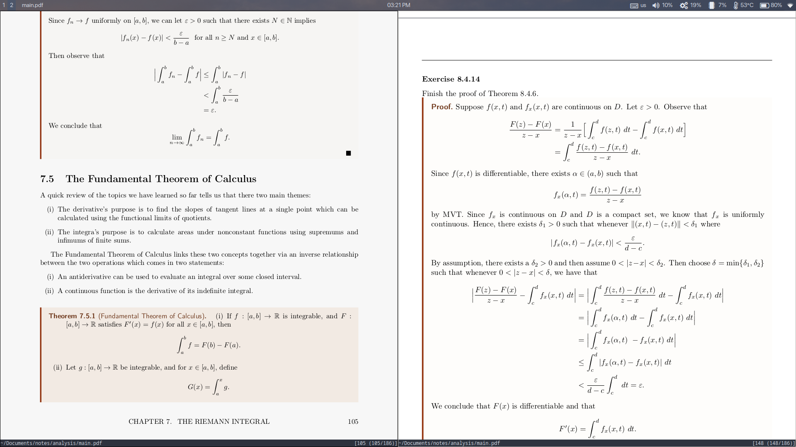
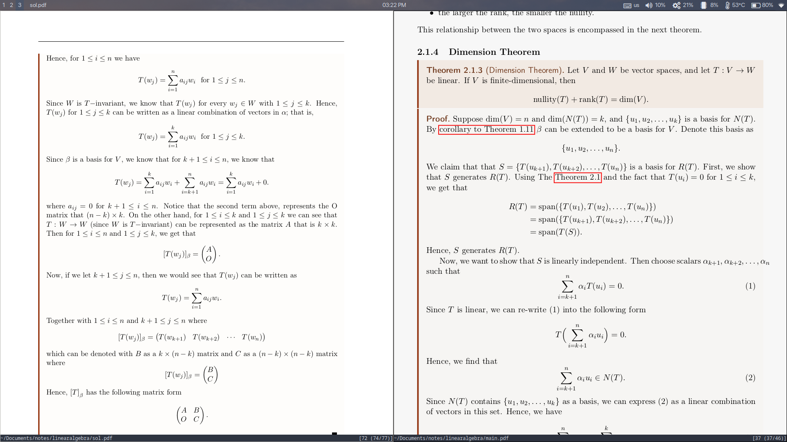

# Textbook Notes and Solutions to Select Exercises

Hi there! Here are some of my textbook notes and solutions to (most) exercises. The purpose of this repo is to be remote backup for these notes as well as document my journey in learning more math.

## Analysis

## Linear Algebra

## Textbooks Used:
- [Understanding Analysis by Stephen Abbott](https://www.amazon.com/Understanding-Analysis-Undergraduate-Texts-Mathematics/dp/1493927116/ref=sr_1_1?crid=3AL6TVKPO65QI&keywords=understanding+analysis&qid=1705275447&s=books&sprefix=understanding+analysi%2Cstripbooks%2C163&sr=1-1)
- [Linear Algebra by Stephen Friedberg 4th Edition](https://www.amazon.com/Linear-Algebra-4th-Stephen-Friedberg/dp/0130084514)
